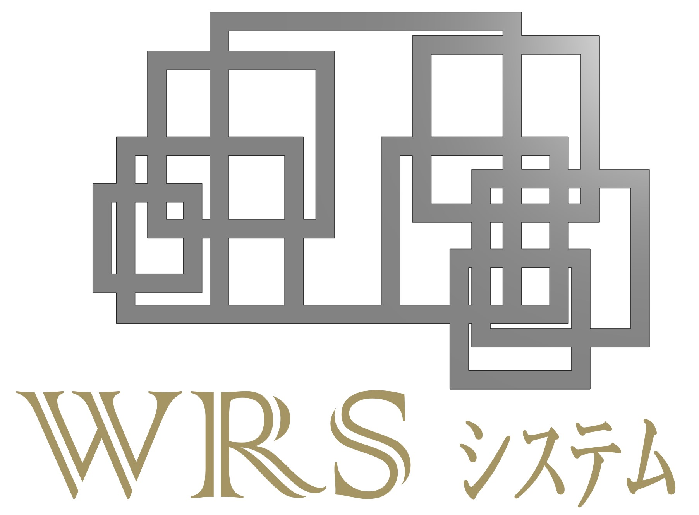

# The WRS Robot Planning & Control System

[](https://opensource.org/licenses/MIT)



WARNING: Python 3.10+; Numpy 1.22 +

This is a brief guide to the WRS Robot Planning & Learning Data Preparation System. For detailed technical descriptions and usage, go to
the [document pages](https://wanweiwei07.github.io/wrs/) hosted at [my homepage](https://wanweiwei07.github.io/).

## Code Inspired by the System
* Universal Robots UR3e Planning & Control System: https://github.com/maganrobotics/urmanipulation

## Getting Started

These instructions will get you a copy of the project up and running on your local machine for development and testing
purposes.

### Prerequisites

The following packages are needed to run this system.

```
panda3d>=1.10.7 # vital, visualization
numpy>=1.22.2 # vital, matrix computation
opencv-python>=4.4.0.46 # optional, required by vision
opencv-contrib-python>=4.4.0.46 # optional, required by vision
scikit-learn>=0.23.2 # vital?
grpcio>=1.34.0
grpcio-tools>=1.34.0
PyYAML>=5.3.1 # grpc formatting
Rtree>=0.9.7 # required by trimesh
open3d>=0.12.0 # required for cloud processing
shapely>=1.7.1 # required by ?
networkx>=2.5.1 # vital
pyserial>=3.4 # required by xarm controllers
pandas>=1.3.4 # required for neuro ik
# cython>=0.29.27 # required for speeding up
# gimpact # optional mesh-level collision detection
```

### Installing

A step by step series of examples that tell you how to get a development env running. The recommended IDE(Integrated
Development Environment) is [PyCharm](https://www.jetbrains.com/pycharm/). You can get a community version for research
purpose at [PyCharm Community Version](https://www.jetbrains.com/pycharm/download/). Other platform like Visual Studio
Code might also be helpful, although I never tested them.

Clone this repository to your local disk and open the folder as a project in your PyCharm IDE, you will see all packages
in the Project View. Their names and usage are as follows.

```
basis: Basic helper functions for math computation, data structure conversion, and trimesh processing.
drivers.devices: Wrapper for the low-level robot or sensor APIs.
drivers.rpc: Remote procedure call interfaces. To be run on remote servers.
grasping: Grasp planners.
manipulation: Stability Analyzers; Placement planners.
planning: Trajectory-level and probabilistic motion-level planners.
robotcon: Interface functions to connect and control robots.
robotsim: Robot classes are defined in this package.
vision: Utility functiosn for processing 2D and 3D vision data.
visualization: Graphics. Panda3D is the main graphics engine.
```

Besides the abovementioned packages, there is a 0000_example folder that hosts several examples. Run the following one
to examine if your the prerequisites and key packages work correctly.

```
TODO
```

## License

This project is licensed under the MIT License - see the [LICENSE.md](LICENSE.md) file for details

## Acknowledgments

* Thank all related students in HLab for using and suggesting to this software.
