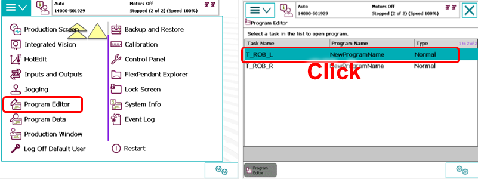
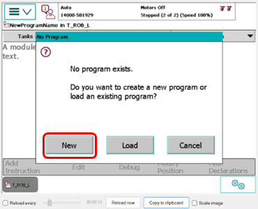
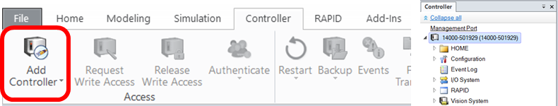

# Tutorial: Using SERVER RAPID on ABB YUMI
## Prerequisites
Before you begin, make sure you have the following:
- **RobotStudio**: Download and install the free version of RobotStudio from the ABB Robotics website. You can get it (https://new.abb.com/products/robotics/robotstudio/downloads).

##  Setting Up ABB YUMI for SERVER RAPID
### Step 1: Creating RAPID Modules and Enabling Remote Mode
1. On the YUMI controller panel, navigate to `Menu`->`Program Editor`->`T_ROB_L` 
    
    
2. In the prompt window that appears, click `New` to create a new RAPID program on the `T_ROB_L`.
    
    

3. Similarly, create a new RAPID program on `Menu`->`Program Editor`->`T_ROB_R` as well.

4. Configure the YUMI controller panel as follows:
    - Set `Motor On/Off` as `On`
    - Set `Operator Mode` as `Auto`
   
    

## Step 2: Setting Up RobotStudio Connection

1. Launch RobotStudio on the computer.
   - On the controller page, establish a connection by clicking `Add Controller`.
   
     

   - On the RAPID page, request write access.

     

## Step 3: Overwriting and Applying RAPID Modules
1. Overwrite the `MainModule` files created earlier for `T_ROB_L` and `T_ROB_R`. You can do this by copying the contents from [SERVER_L.mod](SERVER_L.mod)
    and [SERVER_R.mod](SERVER_R.mod). and then applying the changes.
    
     
    
    - Once successful, the names of the `MainModule` files will change to `SERVER_L` and `SERVER_R`

## Step 4: Executing the Program
1. Press `Ctrl`+`Shift`+`M` to set the `Program Pointer To Main`.
2. Click the `Start` button to execute the program. 
    

3. You'll see both programs running on the YUMI controller panel.

    

By following these steps, you have successfully set up and executed SERVER RAPID on your ABB YUMI robot. You can use [yumi_con.py](..%2F..%2Frobot_con%2Fyumi%2Fyumi_con.py) to communicate with YUMI robot..
